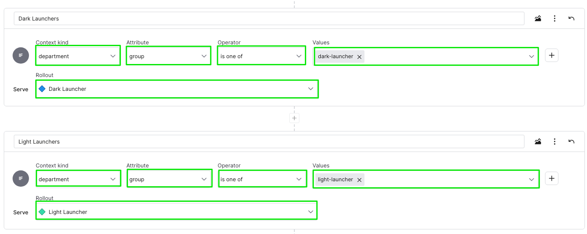

# LaunchDarkly React.js SDK Demo

## Overview

This project demonstrates the integration of LaunchDarkly's React Web SDK into a sample React.js application. It showcases how to implement feature flags and manage different variations of your application using LaunchDarkly's powerful feature management platform.


## Prerequisites

- Node.js >=18.x
- React >=18
- LaunchDarkly React client SDK
- [LaunchDarkly Client-side ID](https://docs.launchdarkly.com/sdk/concepts/client-side-server-side?site=federal#understanding-the-different-types-of-sdks)

## Installation

1. Clone this repository:
   ```
   git clone git@github.com:tanben/launchdarkly-react-demo.git
   cd launchdarkly-react-demo
   ```

2. Install dependencies:
   ```
   npm install
   ```

3. Create a `.env` file in the root directory and add your LaunchDarkly client-side ID:
   ```
   REACT_APP_clientSideID="LD_CLIENT_SIDE_ID"
   ```

## Running the Application

To start the development server:

```
npm start
```

The application will be available at `http://localhost:3000`.

## Building for Production

To create a production build:

```
npm run build
```

To serve the built application:

```
npx serve build
```

## Feature Flag configuration

This demo uses the following feature flags:

### 1. Toggle Details

- **Key**: `toggle-details`
- **Variations**:
  - Light Launcher
  - Dark Launcher
  - Toggle
  - Toggle Thumbsup

Each variation contains properties for background image, hero image, hero name, and name.

Example **Light Launcher** variation, see below for full list. 
```
{
  "backgroundImage": "ThumbsUpLight.png",
  "heroImage": "ThumbsUpLight.png",
  "heroName": "Light Launcher",
  "flagKey":"toggle-details",
  "name": "ThumbsUpLight"
}

```

**Create targeting rules**

Create targeting rules for *Dark Launcher* and *White Launcher* group members. See the example context for available `context` kind and `attributes`.



- **rule**: `Dark Launcher`
- **configuration**:
  - context kind: `department`
  - attribute: `group`
  - operator: `is one of`
  - values: `dark-launcher`


- **rule**: `Light Launcher`
- **configuration**:
  - context kind: `department`
  - attribute: `group`
  - operator: `is one of`
  - values: `light-launcher`
  - 
**Example Context**
```
{
      kind: "multi",
      user: {
        key: "2919c67e-b076-4154-95c5-f99084df77ec",
        name: "Wendell Stroman",
        state: "Kentucky",
        city: "Hendersontown",
        country: "Romania",
      },
      subscription: {
        key: "enterprise",
      },
      application: {
        key: "bluelightning",
        version: "3.7.6",
      },
      department: {
        name: "Baby",
        key: "baby",
        group: "dark-launcher",
      },
      company: {
        name: "Kemmer Inc",
        key: "kemmer-inc",
      },
    },

```


### 2. Dark Mode

- **Key**: `dark-mode`
- **Variations**:
  - Available `(true)`
  - Unavailable `(false)`

### 3. Debug Mode

- **Key**: `debug`
- **Variations**:
  - Available `(true)`
  - Unavailable `(false)`

## Sample Variations

**Light Launcher**
```
{
  "backgroundImage": "ThumbsUpLight.png",
  "heroImage": "ThumbsUpLight.png",
  "heroName": "Light Launcher",
  "flagKey":"toggle-details",
  "name": "ThumbsUpLight"
}

```

**Dark Launcher**
```
{
  "backgroundImage": "ThumbsUpDark.png",
  "heroImage": "ThumbsUpDark.png",
  "heroName": "Dark Launcher",
  "flagKey":"toggle-details",
  "name": "ThumbsUpDark"
}


```

**Toggle**
```
{
  "backgroundImage": "Toggle.png",
  "heroImage": "Toggle.png",
  "heroName": "Toggle",
  "flagKey":"toggle-details",
  "name": "Toggle"
}
```

**Toggle Thumbsup**
```
{
  "backgroundImage": "ToggleThumbsUp.png",
  "heroImage": "ToggleThumbsUp.png",
  "heroName": "Toggle Thumbsup",
  "flagKey":"toggle-details",
  "name": "ToggleThumbsUp"
}
```
## Acknowledgments

- This project was bootstrapped with [Create React App](https://github.com/facebook/create-react-app).
